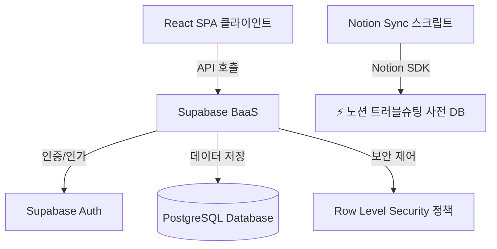

# 🎋 휴먼센터 대나무숲 익명 고충 건의 시스템 (Human Bamboo Forest)

> **"수강생들의 고충을 익명으로 안전하게 수집하고, 실시간 피드백을 통해 소통의 창구를 넓힙니다."**
>
> 본 프로젝트는 **AI 협업 도구를 적극적으로 활용**하여 기획, 개발, 테스트, 배포, 그리고 트러블 슈팅 및 최종 보고에 이르기까지 소프트웨어 개발 수명 주기(SDLC)의 전 과정을 수행하고 경험하는 것을 목표로 설계되었습니다.

---

## 🛠️ AI 도구 활용 체계 (Core Concept)

이 프로젝트는 최신 AI 및 자동화 솔루션의 시너지를 극대화하여 구축되었습니다.

| 단계 | 적용 AI / 자동화 서비스 | 세부 역할 및 경험 가치 |
| :--- | :--- | :--- |
| **개발 (Development)** | **구글 Stitch** + **Anti-Gravity** | **Stitch**를 통한 디자인 시스템 설계 및 UI 컴포넌트 가이드라인 도출, **Anti-Gravity (AI 코딩 어시스턴트)**를 통한 핵심 비즈니스 로직 및 Supabase RLS 정책 신속 구현 |
| **배포 (Deployment)** | **Netlify** | GitHub 저장소와 연동하여 Pull Request 및 메인 브랜치 머지 시 자동으로 빌드되고 배포되는 CI/CD 파이프라인 구축 |
| **트러블 슈팅 (Troubleshooting)** | **Notion (노션 API)** | 개발 과정에서 발생하는 오류 패턴과 조치 내역을 Notion의 트러블 슈팅 사전 데이터베이스와 스크립트로 연동하여 자산화 |

---

## 👥 팀원 및 역할 (R&R)

5인의 전문 협업 팀을 구성하여 각 영역을 주도적으로 완수하였습니다.

*   **변영진 (개발 총괄):** Supabase 보안 인프라 및 RLS 정책 설계, Notion API 통합 개발, 배포 파이프라인 관리
*   **김종록 (데이터 엔지니어링):** PostgreSQL 데이터베이스 스키마 설계, 실시간 댓글 및 계층형 대댓글(답글) 시스템 구현
*   **김혜라 (UI/UX & 모더레이션):** 관리자 모더레이션 대시보드 UX 설계, 클라이언트 사이드 비속어 필터링 알고리즘 및 블라인드 화면 흐름 구현
*   **안민영 (DevOps):** Netlify 자동 배포 환경 구축 및 CI/CD 빌드 프로세스 검증
*   **임장빈 (QA/테스트 총괄):** 사용자 및 관리자 시나리오 기반의 통합 전수 테스트 시나리오 작성 및 품질 검증

---

## 🏗️ 시스템 아키텍처

백엔드 서버 없이 Supabase BaaS(Backend as a Service)를 활용한 서버리스 아키텍처로, 클라이언트의 안전한 데이터 접근을 통제합니다.



### 🔒 핵심 차별화 요소: 섀도 매핑 테이블을 통한 철저한 익명성 보장
> [!IMPORTANT]
> 본인 글만 수정/삭제할 수 있게 제어하면서도 작성자 ID(`user_id`)가 클라이언트에 절대 노출되지 않도록 **섀도 매핑 테이블(Shadow Mapping Table) 패턴**을 사용합니다.
>
> 1. `posts`와 `comments` 테이블에는 `user_id`를 넣지 않습니다.
> 2. 글 작성 시 DB Trigger가 백엔드 내부 보안 컨텍스트(`auth.uid()`)를 조회하여 비밀 테이블인 `post_authors`에 `(글ID, 유저ID)` 형태로 매핑 정보를 기록합니다.
> 3. RLS(Row Level Security) 정책은 오직 `post_authors`에 매핑된 소유자 본인에게만 수정/삭제 권한을 승인하며, `post_authors` 테이블 자체는 타인에게 조회가 원천 차단됩니다.

---

## 🚀 빠른 로컬 실행 환경 구축 가이드 (Quick Start Guide)

GitHub에서 저장소를 클론한 후, 개발 및 로컬 실행 환경을 구축하는 단계입니다.

### Step 1. 저장소 클론 및 패키지 설치
```bash
# GitHub 저장소 클론
git clone https://github.com/jjomton/bambooforest.git
cd bambooforest

# 의존성 패키지 설치
npm install
```

### Step 2. 로컬 환경 변수 설정
프로젝트 루트 경로에 `.env.example` 파일을 참고하여 `.env` 파일을 생성합니다.
```bash
cp .env.example .env
```

`.env` 파일에 아래 정보를 기입합니다.
```env
# Supabase 연동 정보 (Supabase 웹 콘솔 -> Project Settings -> API)
VITE_SUPABASE_URL=your_supabase_project_url
VITE_SUPABASE_ANON_KEY=your_supabase_anon_key

# Notion 트러블 슈팅 아카이빙 연동 정보 (Notion Developers 웹사이트에서 API 키 발급)
NOTION_API_KEY=your_notion_api_key
NOTION_DATABASE_ID=your_notion_database_id
```

### Step 3. 로컬 서버 구동
```bash
# 로컬 개발 서버 실행 (기본 포트: 5173)
npm run dev
```
웹 브라우저를 열고 `http://localhost:5173`으로 접속하면 개발 화면을 확인할 수 있습니다.

---

## 🤖 AI 활동 도구 협업 가이드 (AI Tool Workflow Guide)

### 1. 구글 Stitch 디자인 시스템 반영
*   프로젝트의 UI 프로토타입 시안 및 자산 정보는 `design_assets/` 폴더 내에 배치됩니다.
*   공통 컴포넌트나 레이아웃 변경 시 Stitch가 도출한 CSS 속성과 컴포넌트 마크업 구조를 우선 참고하여 개발을 지속합니다.

### 2. Anti-Gravity AI Agent 활용
*   보안 제어(RLS), 복잡한 트리 구조 대댓글 렌더링, 정규식 기반 텍스트 필터링 등 구현 난이도가 높은 로직은 AI Agent에게 요청하여 신속하게 코드를 생성합니다.
*   **프롬프트 요청 예시:** 
    > *"익명 작성자를 보호하기 위해 `posts` 테이블에 대응하는 `post_authors` 섀도 매핑 테이블을 생성하고, RLS 정책 및 데이터베이스 트리거 함수를 생성하는 SQL 문을 작성해줘."*

### 3. Notion API 기반 트러블 슈팅 자동 연동
개발 도중 해결한 중대한 에러 및 트러블 슈팅(Troubleshooting) 내역을 Notion의 사전 데이터베이스에 CLI 명령어로 즉시 전송하여 아카이빙합니다.
```bash
# 문법: npm run sync:notion -- <작성한 마크다운 문서 경로>
npm run sync:notion -- docs/new_project_report.md
```
*   해당 스크립트는 지정된 `.md` 파일의 구조(Heading, Code, Quote 등)를 정적 파싱하여 노션의 데이터베이스 블록 구조에 맞춰 자동으로 문서를 업로드해 줍니다.

---

## ☁️ 배포 가이드 (Deployment Guide - Netlify)

본 프로젝트는 Netlify를 활용하여 GitHub 저장소와 연동된 자동 배포 파이프라인(CI/CD)을 가집니다.

### Step 1. Netlify 프로젝트 생성 및 연동
1. [Netlify 웹 콘솔](https://app.netlify.com/)에 로그인합니다.
2. **Add new site** -> **Import an existing project** 메뉴를 클릭합니다.
3. GitHub를 선택하고 `bambooforest` 저장소를 연결합니다.

### Step 2. 빌드 환경 설정 (Build Settings)
Netlify 배포 구성 시 다음과 같이 빌드 옵션을 기입합니다. (루트의 `netlify.toml` 설정에 의해 자동 반영되나, 웹 콘솔 확인을 위해 참조하십시오.)

*   **Branch to deploy:** `main` (혹은 배포 전용 브랜치)
*   **Build command:** `npm run build`
*   **Publish directory:** `dist`

### Step 3. Netlify 환경 변수 주입 (Production Environment Variables)
Netlify 대시보드 내 **Site Configuration** -> **Environment variables**에 접속하여 아래 프로덕션 키를 주입합니다.
*   `VITE_SUPABASE_URL`: Supabase 프로덕션 URL
*   `VITE_SUPABASE_ANON_KEY`: Supabase 프로덕션 Anon Key

### Step 4. 배포 상태 확인 및 테스트
*   설정이 완료되면 `main` 브랜치에 코드 push 또는 PR merge 시 Netlify가 감지하여 자동으로 빌드 및 배포를 진행합니다.
*   배포된 고유 도메인 주소(예: `https://xxx.netlify.app`)를 통해 실서버 구동 상태를 확인할 수 있습니다.

---

## 🚨 트러블 슈팅 및 문제 해결 (Troubleshooting)

개발 과정에서 직면한 주요 장애와 원인은 Notion 사전 DB 및 아래 문서에 아카이빙되었습니다.

> [!WARNING]
> **1. PowerShell 실행 보안 장애 (`UnauthorizedAccess`)**
> * **원인:** Windows의 기본 ExecutionPolicy 제한으로 인해 로컬 npm CLI 스크립트 작동이 차단됨.
> * **해결:** 터미널 세션 혹은 실행 인자에 `-ExecutionPolicy Bypass` 옵션을 활용하여 정상 빌드 환경을 구축함.
>
> **2. Notion API 404 데이터베이스 찾기 실패 (`object_not_found`)**
> * **원인:** Notion API 통합 봇이 타겟 데이터베이스에 명시적으로 연결(Connection)되어 있지 않아 권한 거부 오류 발생.
> * **해결:** 노션 DB 페이지 우측 상단의 `연결 추가` 메뉴에서 통합 봇을 연결하여 동기화를 개방함.
>
> **3. Vite 빌드 타입 오류 (`TS2741: Property 'is_blinded' is missing`)**
> * **원인:** Mock 데이터 생성부의 댓글 객체들에 필수 속성인 `is_blinded` 속성이 빠져 정적 컴파일 오류 유발.
> * **해결:** Mock 데이터 구조 정의에 `is_blinded: false` 기본값을 일괄 보완하여 빌드를 통과함.
