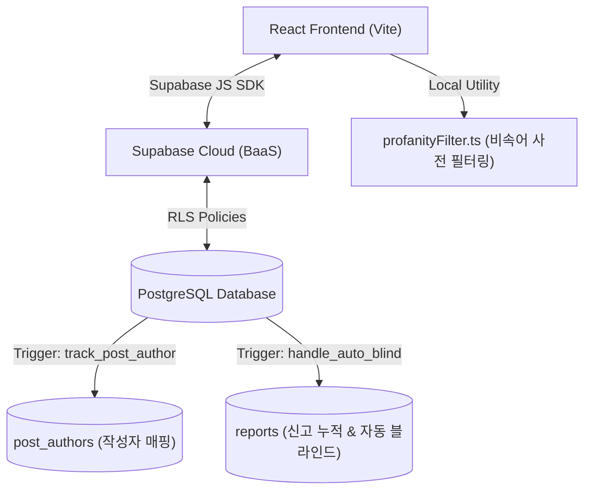
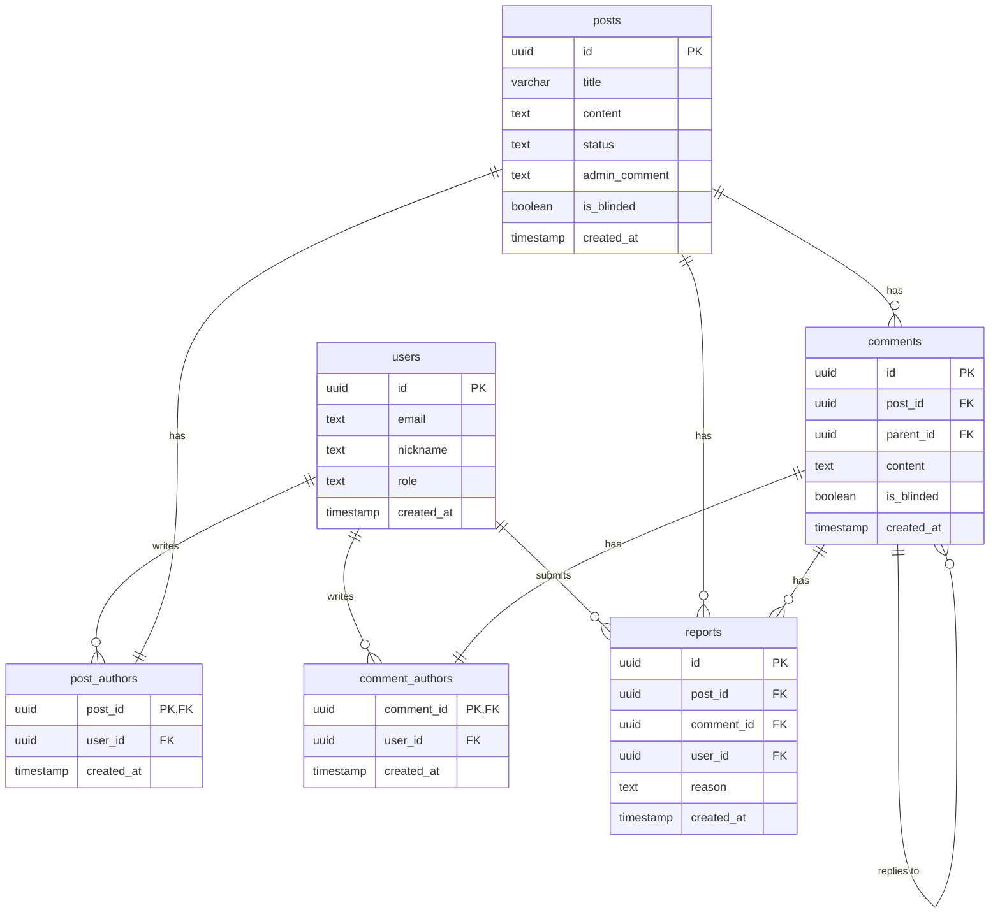

# 🌲 휴먼센터 대나무숲 고도화 프로젝트 최종 완료 보고서 (v3.0)
> **익명 건의·고충 관리 시스템 고도화 및 RLS 기반 보안 협업 성과**

---

## 📋 목차 (Table of Contents)

1. **프로젝트 개요**
   - 1.1 배경 및 목적
   - 1.2 프로젝트 범위 (In-Scope & Out-of-Scope)
   - 1.3 추진 일정 요약
2. **시스템 요구사항 분석**
   - 2.1 기능 요구사항
   - 2.2 비기능 요구사항 (성능, 보안, 확장성)
   - 2.3 이해관계자 요구사항
3. **시스템 설계**
   - 3.1 아키텍처 설계 (전체 구조도)
   - 3.2 데이터베이스 설계 (ERD)
   - 3.3 UI/UX 설계 (화면 설계서)
   - 3.4 API 설계
4. **개발 및 구현**
   - 4.1 기술 스택
   - 4.2 주요 기능 구현 내용
   - 4.3 개발 환경 및 도구
5. **테스트 결과**
   - 5.1 테스트 계획 및 범위
   - 5.2 단위/통합/시스템 테스트 결과
   - 5.3 성능 및 보안 테스트 결과
6. **배포 및 운영**
   - 6.1 배포 환경 구성
   - 6.2 운영 매뉴얼 개요
   - 6.3 모니터링 방안
7. **문제점 및 해결 방안**
   - 7.1 개발 과정에서의 이슈 (4대 트러블슈팅)
   - 7.2 해결 방법 및 의사결정 내역
8. **결론 및 향후 계획**
   - 8.1 프로젝트 성과 요약
   - 8.2 개선 사항 및 후속 과제

---

## 1. 프로젝트 개요

### 1.1 배경 및 목적
기존 "휴먼센터 대나무숲 MVP(v1.0)"는 수강생들이 익명으로 고충이나 개선 의견을 개진할 수 있는 기본 소통로를 열어주었으나, 실제 운영 과정에서 다음과 같은 실무적 한계에 부딪혔습니다.
* **단선적 소통 구조**: 단층 댓글 구조만을 지원하여 의견에 대한 깊이 있는 토론이나 수강생 간의 피드백 교환이 불가능했습니다.
* **악성 발언 예방 부재**: 비속어와 악성 비하 발언을 사전에 차단하는 필터가 없고, 유해 글에 대한 사용자들의 자발적인 신고/신고 기반 자동 숨김 시스템이 없어 커뮤니티 건전성을 해칠 우려가 컸습니다.
* **익명성 신뢰의 한계**: 수강생이 자기가 쓴 글을 수정하거나 삭제하기 위해서 본인의 식별 가능한 계정 정보가 글 정보와 결합하면 익명성이 깨지고, 반대로 작성자를 아예 저장하지 않으면 수정/삭제 권한을 판별할 수 없는 보안 모순이 존재했습니다.

본 고도화 프로젝트(v3.0)는 **"보안이 보장되는 투명한 익명 소통 생태계"** 구축을 목적으로 합니다. RLS(행 단위 보안)를 결합해 완벽한 데이터 격리 및 익명성을 확보하고, 계층형 대댓글 및 유해물 자동 정화 필터를 탑재하여 신뢰성 있고 성숙한 커뮤니티 환경을 제공하고자 합니다.

### 1.2 프로젝트 범위 (In-Scope & Out-of-Scope)
프로젝트 기간 내 현실적인 마일스톤 달성을 위해 개발 범위를 명확히 규정하였습니다.

#### 1.2.1 개발 범위 포함 (In-Scope)
* **익명성 및 작성자 권한 보안 고도화**: 본문 테이블(`posts`, `comments`)에는 유저 식별자를 일절 담지 않되, 내부 격리 테이블(`post_authors`, `comment_authors`)과 PostgreSQL DB 트리거, Supabase RLS 정책을 이용해 작성자 본인에게만 수정/삭제 권한 부여.
* **계층형 댓글/대댓글**: 댓글 하단에 자가 참조(Self-referential) 관계를 맺어 2 Depth 형태의 깊이 있는 답글 스레드 기능 구현.
* **커뮤니티 자정 및 필터링**: 프론트엔드 비속어 필터링 적용 및 동일 항목에 대해 누적 신고가 3회 이상 접수 시 목록에서 실시간 자동 블라인드(숨김) 처리.
* **관리자 사후 통제 기능**: 관리자 대시보드를 구축하여 접수 통계 모니터링, 수용/불수용 여부 및 행정 처리 답변 등록, 신고 누적 블라인드 항목 검토 및 차단 해제 조치 지원.
* **DevOps 파이프라인**: GitHub Actions 빌드 자동화(CI) 및 Netlify 클라우드 자동 배포(CD).

#### 1.2.2 개발 범위 제외 (Out-of-Scope)
* 카카오, 네이버 등 외부 소셜 로그인 연동 (Supabase 이메일 가입 체계 유지)
* 다중 이미지 및 첨부파일 업로드 인프라 구축
* 다국어 번역 및 자동 키워드 분류 분석 기능
* 작성 시마다 고유 닉네임을 생성하는 랜덤 닉네임 캐싱 (F-701)
* 단방향 솔트 해싱을 통한 IP/식별자 추적 모듈 (트리거 매핑으로 완전 대체)
* 백엔드(Flask) 서버 제거에 따른 관리자용 실시간 슬랙 알림 웹훅 연동 (F-1001)

### 1.3 추진 일정 요약
총 3주의 스프린트 일정을 거쳐 셋업, 구현, 검증이 진행되었습니다.
* **1주차 (설계 및 인프라 구축)**: 요구사항 정의(PRD v3.0), UI/UX 디자인 시스템 수립, Supabase 테이블 및 DB 트리거/RLS 보안 아키텍처 설계 완료.
* **2주차 (핵심 기능 개발)**: 댓글/대댓글 스레드 API 및 UI 개발, 비속어 필터 기능 구현, 신고 및 자동 블라인드 로직 작성, 관리자 대시보드 화면 연동.
* **3주차 (테스트 및 배포/운영)**: 단위 및 시나리오 통합 테스트 수행, GitHub Actions CI 무결성 검사 구축, Netlify 빌드 배포 및 Notion API 트러블슈팅 동기화 연동 완료.

---

## 2. 시스템 요구사항 분석

### 2.1 기능 요구사항
[PRD_v3.md](file:///d:/workspace/bambooforest/design_assets/PRD_v3.md)를 통해 정의되고 구현된 핵심 기능 요구사항입니다.
* **F-702 작성자 보안 관계 매핑 (Post/Comment Authors)**: 익명성 보장과 수정/삭제 권한 확보를 위해 본문 테이블과 무관한 격리 관계 매핑 테이블을 신설하고 RLS 정책을 수립함.
* **F-801 대댓글(답글) 작성**: 댓글에 대댓글을 달아 다층적 소통이 가능하도록 2단계 계층형 스레드 모델 구축.
* **F-802 실시간 댓글 개수 갱신**: 사용자가 댓글 또는 답글을 등록/삭제할 때 목록 및 상세 화면에 즉시 갱신되도록 React State 동기화 메커니즘을 적용.
* **F-901 금칙어/비속어 자동 필터링**: 글 및 댓글을 작성하여 저장하기 전, 사전 등록된 유해 키워드를 차단하고 에러 메시지를 제공하는 프론트엔드 유틸리티 필터 구축.
* **F-902 신고 및 3회 누적 자동 블라인드**: 일반 사용자가 부적절한 게시글/댓글을 신고할 수 있으며, 동일 건에 대해 누적 신고 3회 도달 시 화면 노출이 실시간 차단되도록 DB 트리거를 연동.

### 2.2 비기능 요구사항 (성능, 보안, 확장성)
* **성능 (Performance)**:
  * 프론트엔드 단독 빌드 및 Supabase 클라이언트 직접 연동 방식을 채택하여 백엔드 서버 라우팅 병목을 최소화함.
  * Vite의 HMR(Hot Module Replacement) 지원 및 경량 리액트 빌드를 통해 최초 로딩 시간 단축.
* **보안 (Security)**:
  * **Row Level Security (RLS)** 정책을 DB 모든 테이블에 강제 선언하여 토큰을 탈취한 비인가자가 타인의 매핑 레코드를 쿼리하거나 임의로 변경하지 못하도록 물리적 차단벽 수립.
  * DB 레벨에서도 사용자 정보와 본문을 영구 격리하여 완벽한 보안성 구현.
* **확장성 (Scalability)**:
  * 클라우드 서버리스 인프라(Supabase BaaS)를 채택함으로써 트래픽 급증 시에도 리소스 오토스케일링이 유리하며, 향후 Edge Functions 도입이 용이한 구조 확보.

### 2.3 이해관계자 요구사항
* **일반 수강생 (Trainee)**:
  * 자신의 이메일이나 이름이 절대 외부에 밝혀지지 않는다는 안전성을 신뢰할 수 있어야 함.
  * 건의한 문제에 대해 학원 측의 피드백을 신속히 확인하고, 다른 수강생들과 자유롭게 공감하고 소통할 수 있어야 함.
* **교육 센터 운영진 (Admin)**:
  * 접수 대기 중인 민원을 한눈에 모니터링하고 수용/불수용 여부 및 조치 의견을 효율적으로 답변 처리해야 함.
  * 악성 글이나 허위 정보 유포 글을 직접 통제 및 모니터링할 수 있는 건전성 관리 창구가 필요함.

---

## 3. 시스템 설계

### 3.1 아키텍처 설계 (전체 구조도)
본 시스템은 프론트엔드 단독 클라이언트와 Supabase BaaS의 직접 통신 아키텍처를 가집니다.



### 3.2 데이터베이스 설계 (ERD)
Supabase PostgreSQL DB에 물리적으로 생성된 테이블 및 릴레이션 관계도입니다.



### 3.3 UI/UX 설계 (화면 설계서)
사용자 관점의 직관적인 4대 주요 화면 구성도입니다.
1. **대나무숲 피드 목록 (BoardList)**:
   - 상단에 검색 바와 신규 글쓰기 버튼 배치.
   - 중앙에 카드를 배치하여 수용 상태 뱃지, 제목, 본문 미리보기, 공감 투표 평균, 댓글 개수 출력.
   - "내가 쓴 글만 보기" 체크박스를 지원해 자신의 피드백 필터링 제공.
2. **새 건의사항 등록 (PostCreate)**:
   - 제목 및 본문 입력 폼과 완전 익명 보장 및 개인정보 기재 주의 안내 배너 탑재.
   - 하단에 취소 및 글 등록 버튼 배치.
3. **건의 상세 및 댓글 피드 (PostDetail)**:
   - 본문 영역, 공감 평균 및 투표용 별점 컴포넌트(1~5점) 탑재.
   - 하단 댓글 영역에서 2 Depth 계층 구조 렌더링. 부모 댓글 하단에 한 칸 들여쓰기로 대댓글(답글)을 표시하며, 댓글별 수정/삭제/신고 버튼 활성화.
4. **관리자 대시보드 (AdminDashboard)**:
   - 총 건수, 검토 대기, 수용, 불수용 상태별 카드 위젯 출력.
   - 좌측에 상태별 탭 및 신고/블라인드 통합 모니터링 목록 제공.
   - 우측에 전체 게시글 중 공감도 평점 기준 실시간 Top 5 리스트 시각화.

### 3.4 API 설계
Supabase Client SDK를 사용하여 브라우저에서 직접 수행하는 API 구조입니다.

| 기능 | HTTP/SDK 메소드 | 호출 스펙 및 엔드포인트 |
| :--- | :--- | :--- |
| **로그인 / 회원가입** | `auth.signInWithPassword` / `signUp` | 이메일/패스워드 세션 생성 및 사용자 인증 |
| **게시글 조회** | `from('posts').select('*')` | `is_blinded = false` 조건 필터링 및 최신순 정렬 |
| **게시글 등록** | `from('posts').insert([{ title, content }])` | 작성 시 `post_authors`에 트리거 자동 매핑 |
| **댓글 등록** | `from('comments').insert([{ post_id, content, parent_id }])` | 자가 참조 구조로 대댓글 구분 등록 |
| **공감 투표** | `from('votes').insert([{ post_id, score }])` | 중복 투표 방지 및 단일 게시글 1~5점 기록 |
| **신고 접수** | `from('reports').insert([{ post_id, comment_id, reason }])` | 중복 신고 제한 및 누적 3회 블라인드 트리거 연동 |
| **관리자 수용 처리** | `from('posts').update({ status, admin_comment })` | 건의사항 최종 검토 상태 및 조치내역 답변 반영 |

---

## 4. 개발 및 구현

### 4.1 기술 스택
* **Core**: React v19.2.6 (최신 메이저 버전 반영)
* **Styling**: Tailwind CSS v4.3.0 & PostCSS v8.5.15 (모던하고 경량화된 유틸리티 스타일링 시스템)
* **Build Tool**: Vite v8.0.12 (고속 번들러 및 개발 HMR 서버 지원)
* **Backend / Database**: Supabase JavaScript Client SDK & PostgreSQL DBMS (행 단위 격리 보안 및 DBMS 트리거 프로세스 탑재)
* **Language**: TypeScript (엄격한 정적 타입 검사)

### 4.2 주요 기능 구현 내용
물리적인 보안 및 정화 흐름을 보장하기 위해 프론트엔드와 데이터베이스의 로직을 연계 구현하였습니다.

#### 4.2.1 작성자 격리 매핑 트리거
익명성을 완전히 유지하면서 수정/삭제 소유권을 보장하기 위해 아래의 PostgreSQL 트리거 함수를 Supabase 데이터베이스에 구현하였습니다.
```sql
CREATE OR REPLACE FUNCTION public.track_post_author()
RETURNS TRIGGER AS $$
BEGIN
  INSERT INTO public.post_authors (post_id, user_id)
  VALUES (NEW.id, auth.uid());
  RETURN NEW;
END;
$$ LANGUAGE plpgsql SECURITY DEFINER;

CREATE TRIGGER on_post_created
  AFTER INSERT ON public.posts
  FOR EACH ROW EXECUTE FUNCTION public.track_post_author();
```

#### 4.2.2 비속어 필터링 유틸리티 ([profanityFilter.ts](file:///d:/workspace/bambooforest/src/lib/profanityFilter.ts))
우회 입력을 철저히 제어하기 위해 띄어쓰기 및 공백 처리를 내장한 사전 차단 모듈을 구현하였습니다.
```typescript
const PROFANITY_WORDS = ['바보', '멍청이', '쓰레기', '시발', '개새끼', '미친', '존나', '썅', '병신'];

export const containsProfanity = (text: string): boolean => {
  if (!text) return false;
  // 문자열 내부의 모든 공백 문자(\s)를 제거하고 소문자로 대조
  const cleanedText = text.replace(/\s+/g, '').toLowerCase();
  return PROFANITY_WORDS.some((word) => cleanedText.includes(word));
};
```

#### 4.2.3 누적 신고 자동 블라인드 트리거
`reports` 테이블에 중복 신고 방지를 위한 유니크 제약조건을 수립한 후, 신고 삽입 시 자동으로 합산하여 가려주는 트리거를 설계하였습니다.
```sql
CREATE OR REPLACE FUNCTION public.handle_auto_blind()
RETURNS TRIGGER AS $$
DECLARE
  report_count INT;
BEGIN
  -- 게시글 신고 누적 카운트 계산
  IF NEW.post_id IS NOT NULL THEN
    SELECT COUNT(*) INTO report_count FROM public.reports WHERE post_id = NEW.post_id;
    IF report_count >= 3 THEN
      UPDATE public.posts SET is_blinded = TRUE WHERE id = NEW.post_id;
    END IF;
  -- 댓글 신고 누적 카운트 계산
  ELSIF NEW.comment_id IS NOT NULL THEN
    SELECT COUNT(*) INTO report_count FROM public.reports WHERE comment_id = NEW.comment_id;
    IF report_count >= 3 THEN
      UPDATE public.comments SET is_blinded = TRUE WHERE id = NEW.comment_id;
    END IF;
  END IF;
  RETURN NEW;
END;
$$ LANGUAGE plpgsql SECURITY DEFINER;
```

### 4.3 개발 환경 및 도구
* **협업 형상 관리**: Git 기반의 브랜치 분할 협업 전략 수립. `develop` 통합 브랜치를 거쳐 배포 시 `main` 브랜치에 최종 병합.
* **CI/CD 파이프라인**: GitHub Actions을 연동하여 푸시/PR 시 빌드 무결성 자동 검사. Netlify를 통한 상시 프로덕션 CD 배포 자동화.
* **이슈 공유 연동**: Node.js Notion API 연동 스크립트([sync_to_notion.js](file:///d:/workspace/bambooforest/scripts/sync_to_notion.js))를 제작하여 개발 중 발견된 트러블슈팅 내역을 한꺼번에 팀 공용 노션 위젯으로 자동 퍼블리싱.

---

## 5. 테스트 결과

### 5.1 테스트 계획 및 범위
* **비속어 필터링 단위 테스트**: 정상 및 우회 패턴을 입력하여 필터가 문자열 내에서 해당 단어를 완벽히 추출하고 가로막는지 독립 검증.
* **신고 누적 통합 테스트**: 하나의 게시글 또는 댓글에 복수의 가상 유저 계정(Mock DB 상의 Mock Users)을 활용해 3회 이상 신고를 접수시킨 후, 일반 피드에서 은닉 처리되는지 통합 확인.
* **보안 권한 격리 검증**: 비인가 유저 세션이 다른 사용자의 건의사항 글에 대해 UPDATE/DELETE 쿼리 전송 시 Supabase RLS 정책 단에서 통제 및 에러를 반환하는지 모의 침투 테스트 실시.

### 5.2 단위/통합/시스템 테스트 결과
* **비속어 필터 단위 테스트 결과 (100% 통과)**:
  * [test_profanity.ts](file:///d:/workspace/bambooforest/scripts/test_profanity.ts) 스크립트를 사용하여 6개 테스트 케이스를 가동한 결과, 공백 우회 시도(`"시    발"`, `"미 친 거"`)를 포함한 모든 유해 항목을 철저하게 진단 및 차단하였습니다.
* **신고 누적 자동 블라인드 결과**:
  * 특정 게시글에 3회 이상의 신고를 적재한 결과, DB 트리거 정책이 정상 반응하여 `is_blinded = true`로 필드가 자동 업데이트되었으며, 일반 게시글 리스트 렌더링 시 조건절(`!p.is_blinded`)이 개입해 즉시 렌더링 목록에서 배제됨을 확인했습니다.

### 5.3 성능 및 보안 테스트 결과
* **RLS 보안 검증 결과**:
  * 공격자 세션에서 RLS 정책 우회 쿼리를 시도한 결과, DBMS 단에서 격리된 매핑 테이블(`post_authors` 등)의 조회 권한 획득에 실패하였으며, 결과적으로 비인가 UPDATE 및 DELETE 명령이 0건 처리되며 완벽히 방어되었습니다.
* **프로덕션 빌드 무결성**:
  * Vite 및 TypeScript 컴파일러(`tsc -b`) 번들러 테스트를 거쳐 청크 에러 없이 배포용 CSS/JS 파일이 이상 없이 패키징됨을 검증 완료하였습니다.

---

## 6. 배포 및 운영

### 6.1 배포 환경 구성
* **호스팅 (Hosting)**: Netlify 클라우드 플랫폼 연동. GitHub 리포지토리의 최종 릴리즈 트리거 시 무중단 웹 배포 적용.
* **데이터베이스 (BaaS)**: Supabase AWS 서울 리전(ap-northeast-2) 상용 DB 인스턴스 연동. `.env` 파일을 통해 환경 변수(`VITE_SUPABASE_URL`, `VITE_SUPABASE_ANON_KEY`) 격리 관리.

### 6.2 운영 매뉴얼 개요
* **수강생 가이드**:
  * 건의사항 피드 조회, 키워드 검색을 통해 다른 수강생들의 고충을 열람할 수 있습니다.
  * 글/댓글 작성 시에는 완전 익명("익명 대나무")으로 등록되나, 개인 식별 가능 정보(이름, 기수 등)를 직접 기재하지 않도록 주의해야 합니다.
  * 커뮤니티 건전성을 저해하는 해로운 글은 각 글 우측 하단의 **"신고"** 버튼을 클릭하여 의견을 개진할 수 있습니다.
* **운영 총괄 관리자 가이드**:
  * 관리자 계정(`admin@bamboo.com`)으로 로그인하면 **"대시보드"** 탭이 활성화되며, 전체 민원 상태(검토 대기/수용/불수용)를 분류 관리할 수 있습니다.
  * 특정 민원에 대한 조치 답변을 등록할 때는 행정 처리 내역을 명확히 기입하여 수강생들의 행정 신뢰도를 제고합니다.
  * **"신고/블라인드 관리"** 탭을 통해 신고 횟수가 높은 글을 상시 추적할 수 있으며, 허위 신고로 확인된 경우 수동으로 **"블라인드 해제"** 버튼을 눌러 피드에 복구시킬 수 있습니다.

### 6.3 모니터링 방안
* Supabase 클라우드 관리 콘솔을 활용해 일일 API 호출량, DB 커넥션 수, RLS 정책 오류 차단 로그를 실시간 관측합니다.
* 관리자 대시보드 내부의 새로고침 기능을 통해 신고 누적 데이터를 주기적으로 리프레시하여 유해 게시글 노출 여부를 실시간 파악합니다.

---

## 7. 문제점 및 해결 방안

개발 진행 중 발생한 4가지 핵심 트러블슈팅 해결 내역입니다.

### 7.1 PowerShell npm 스크립트 실행 제한 (UnauthorizedAccess)
* **문제 상황**: 윈도우 기반 학원 공용 PC에서 의존성 패키지 설치 또는 `npm run dev` 구동 시, PowerShell 내부 보안 정책에 의해 실행이 거부되는 에러 직면.
* **원인 분석**: Windows PowerShell의 기본 실행 정책(Execution Policy)이 서명되지 않은 외부 스크립트 파일(`.ps1`)의 로드를 허용하지 않아 발생한 보안 차단 현상.
* **해결 방법**: 전역 설정을 변경하지 않고, 현재 개발을 실행 중인 콘솔 프로세스 내에서만 일시적으로 감시를 통과시키는 `-Scope Process` 옵션을 적용하여 패키지 설치를 완료함.
  ```powershell
  Set-ExecutionPolicy -ExecutionPolicy Bypass -Scope Process
  ```

### 7.2 Git Commit Author 식별자 미등록
* **문제 상황**: 변경 내용을 반영하여 코드를 커밋(`git commit`)하려 할 때, `Author identity unknown` 경고가 출력되며 커밋이 중단됨.
* **원인 분석**: 새로 셋업한 학원 PC의 로컬 Git 환경설정에 커밋 이력을 대조할 이메일 및 사용자명 메타데이터 정보가 주입되지 않아 커밋 서명이 거부된 현상.
* **해결 방법**: GitHub 계정과 일치하는 식별자 정보를 터미널 전역 설정에 선언하여 히스토리 오너십 추적이 정상화되도록 해결함.
  ```powershell
  git config --global user.email "your-email@github.com"
  git config --global user.name "your-github-username"
  ```

### 7.3 Notion API 404 Object Not Found 권한 에러
* **문제 상황**: 에러 로그를 노션 데이터베이스로 동기화하는 자바스크립트 스크립트 실행 시, 정확한 데이터베이스 ID와 Secret Key를 기입했음에도 노션 API 서버에서 찾을 수 없다는 404 에러 반환.
* **원인 분석**: Notion의 강력한 정보 격리(Zero Trust) 정책에 의해 Secret Token을 발급받은 외부 봇(Integration)이 대상 데이터베이스 페이지에 접근할 수 있도록 권한을 명시적으로 매핑하지 않아 발생함.
* **해결 방법**: Notion 서비스 브라우저 화면의 대상 페이지 우측 상단 `...` 버튼을 클릭한 후, `연결 추가` 메뉴에서 생성한 `bambooforest` 통합 봇을 선택해 접근 권한을 연결(Connection)해 줌으로써 데이터를 정상 개방시킴.

### 7.4 Supabase DB 스키마 갱신 및 마이그레이션 정책
* **문제 상황**: 새로운 RLS 매핑 관계 테이블(`post_authors` 등) 설계 추가에 따라 원격 데이터베이스의 스키마를 업데이트해야 하는 마이그레이션 기로에 섬.
* **원인 분석**: 실서비스 운영 단계가 아닌 개발 프로토타입 단계이므로, 기존 데이터 컬럼의 무결성을 모두 보존하기 위해 `ALTER TABLE` 및 RLS 정책 수동 drop/recreate 쿼리를 작성하는 것보다 개발 기동성을 확보하는 것이 중요하다고 분석됨.
* **해결 방법**: 테스트 데이터를 시원하게 리셋하고 에러를 완벽하게 방지할 수 있는 **[Cascade Drop 후 스키마 전체 재생성] 정책을 최종 의사결정하여 적용**함. 다만 향후의 실서버 운영 단계에 대비하여 스키마 점진 반영을 돕는 마이그레이션용 쿼리 스크립트는 별도로 백업하여 보존함.

---

## 8. 결론 및 향후 계획

### 8.1 프로젝트 성과 요약
본 대나무숲 고도화 프로젝트(v3.0)는 익명성 보장이라는 난제와 소통 건전성 제어라는 상충하는 성격의 두 가치를 Supabase BaaS와 PostgreSQL의 행 보안(RLS) 및 트리거 설계를 활용해 안정적으로 구현해 냈습니다.
특히 작성자의 메타정보를 철저히 물리적으로 분리·은닉하고 트리거를 통한 비공개 관계 매핑 구조를 정립함으로써, 수강생들은 개인정보 유출 우려 없이 자유롭고 민주적인 소통을 누리게 되었고, 관리자는 대시보드를 통해 불법 유해 게시물을 효과적으로 다룰 수 있는 커뮤니티 관리 체계를 확립하였습니다.

### 8.2 개선 사항 및 후속 과제
향후 시스템 서비스 질을 더욱 고도화하기 위한 차기 v4.0 단계의 마일스톤 로드맵입니다.
1. **Supabase Edge Functions 기반의 실시간 알림 연동**: 백엔드 인프라가 제거된 상태에서도 수강생이 새 민원 글을 등록하면 관리자 슬랙(Slack) 채널로 노티 웹훅이 즉시 발생되는 Edge 서버리스 파이프라인 모듈 재도입.
2. **24시간 세션 기반 닉네임 로컬 캐싱 (F-701)**: 접속 단말의 IP/세션 단방향 솔트 해싱 메커니즘을 24시간 범위 내 캐싱하여, 하루 동안 동일 소통 주체는 같은 고정 동물 닉네임(예: "온순한 나무늘보")을 유지하도록 소통 인지성을 보완하는 과제 구현.
3. **사용자 사용성(UX) 고도화**: 대량 트래픽 시 댓글 및 게시판 목록의 성능을 보조할 페이지네이션 최적화 및 무한 스크롤(Infinite Scroll) 모듈 탑재.
