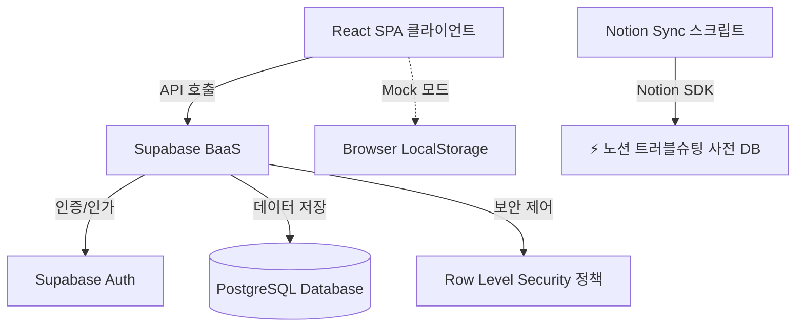
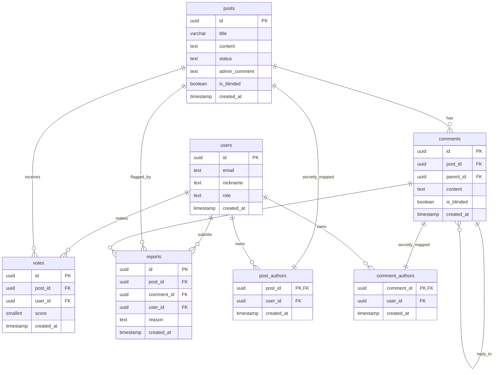
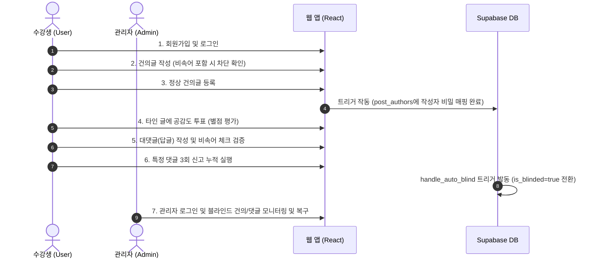

# [최종 보고서] 휴먼센터 대나무숲 익명 고충 건의 시스템 결과 보고서

본 보고서는 학원 수강생들의 고충 및 불편사항을 안전하게 수집하고 처리 현황을 실시간 피드백하기 위해 개발된 **'휴먼센터 대나무숲'** MVP 프로젝트의 최종 성과 보고서입니다.

---

## 01. 프로젝트 개요

### 1.1 문제 정의 및 목표
* **배경 및 문제 정의:** 
  학원 내 수강생들이 장시간 학습을 진행하면서 겪는 강의실 환경(에어컨 온도, 휴게실 혼잡, 비품 부족 등)에 대한 고충과 건의사항을 직접 건의하기에 심리적 장벽이 컸으며, 이에 대한 수렴과 피드백 프로세스가 불투명하여 불만이 누적되는 구조적 한계가 존재했습니다.
* **프로젝트 목표:**
  완벽한 **익명성**을 보장하여 수강생들이 심리적 부담 없이 민원을 제출할 수 있는 소통 창구를 개설하고, 학원 운영진(관리자)이 이에 대해 수용 여부 및 처리 현황을 투명하게 공시하며, 비속어 필터링과 자동 블라인드 정책을 통해 커뮤니티의 자정 능력을 갖춘 웹 애플리케이션을 구축합니다.

### 1.2 팀원 및 역할 (R&R)
3인 협업 개발팀을 구성하여 각자의 전문 영역을 살려 개발을 완료하였습니다.

| 성명 | 직책 | 담당 역할 및 성과 |
|:---:|:---:|:---|
| **안민영** | **대표 (PM)** | 개발 총괄, Supabase 보안 인프라 설계, RLS 정책 수립, Notion API 통합 및 배포 자동화 |
| **김종록** | **팀원 (DB/BE)** | 데이터베이스 스키마 설계, 실시간 댓글 및 계층형 대댓글(답글) 시스템 구현 |
| **김혜라** | **팀원 (FE/UX)** | 모더레이션 화면(신고 현황판) UX 설계, 클라이언트 비속어 필터링 및 자동 블라인드 프론트 흐름 구현 |

### 1.3 개발 일정
* **1단계 (기획 및 스키마 설계):** 기능 정의서(PRD v2) 작성 및 Supabase DB 관계 모델링
* **2단계 (핵심 기능 구현):** 익명 게시판 및 공감도 평점 투표 시스템 개발
* **3단계 (고급 기능 추가):** 관리자 모더레이션 대시보드, 계층형 대댓글 시스템, 비속어 필터링 도입
* **4단계 (통합 및 마이그레이션):** 팀원 브랜치 코드 충돌 병합, 데이터베이스 마이그레이션 스크립트 실행 및 배포 검증

### 1.4 기술 스택 (Technology Stack)
* **Frontend:** React (v19), TypeScript, Vite, Tailwind CSS (v4)
* **Backend & Database:** Supabase (PostgreSQL, Realtime, serverless Auth)
* **API & Automation:** Node.js CLI Script, Notion API (Troubleshooting 사전 연동)
* **CI/CD:** GitHub Actions (PR & Push 자동 빌드 검증)

---

## 02. 프로젝트 설계 및 아키텍처

### 2.1 핵심 기능 요구사항
1. **익명 건의 투고:** 수강생은 로그인 후 제목과 본문을 작성하여 건의할 수 있으며 작성자 신원은 외부 노출되지 않음.
2. **공감도 평가:** 수강생들은 각 건의 사항에 대해 1~5점 사이의 평점을 매겨 공감도를 평가함 (중복 투표 방지, 취소 및 점수 변경 지원).
3. **계층형 대댓글:** 건의 글에 대한 활발한 토론을 위해 원 댓글 아래에 답글(대댓글)을 다는 계층 구조 지원.
4. **관리자 수용 여부 공시:** 관리자는 각 고충 글에 대해 '검토 대기', '수용', '불수용' 상태와 함께 공식 조치 의견을 게시함.
5. **모더레이션:** 부적절한 글/댓글에 대한 자가 자정 작용(신고 제도) 및 AI 수준의 비속어 자동 차단 기능.

### 2.2 시스템 아키텍처
본 시스템은 백엔드 서버를 직접 구축하지 않고 Supabase의 BaaS(Backend as a Service) 인프라를 활용하여 서버리스 구조로 설계되었습니다.

### 2.3 RLS 기반 익명 권한 제어 보안 설계 (★ 핵심 차별화 요소)
익명 게시판에서 가장 까다로운 보안 요구사항은 **"본인이 작성한 글만 수정/삭제하게 하되, 작성자의 정보가 노출되지 않아야 한다"**는 점이었습니다. 일반적인 DB 설계처럼 `posts` 테이블에 `user_id`를 컬럼으로 두고 외래키를 맺으면, 클라이언트가 API로 조회할 때 작성자 정보가 함께 유출될 위험이 큽니다.

이에 안민영 대표가 설계한 **섀도 매핑 테이블(Shadow Mapping Table) 패턴**을 적용하여 이 문제를 해결하였습니다.

1. **`posts` 테이블과 `comments` 테이블**에는 작성자 ID(`user_id`) 컬럼을 두지 않습니다.
2. 대신 별도의 비밀 테이블인 **`post_authors` 및 `comment_authors`** 테이블을 생성합니다.
3. 글이나 댓글이 성공적으로 추가되면 데이터베이스 트리거(`on_post_created`, `on_comment_created`)가 백엔드 내부 보안 컨텍스트(`auth.uid()`)를 읽어와 비밀 테이블에 `(글ID, 유저ID)` 형태로 매핑 정보를 기록합니다.
4. **RLS(Row Level Security) 정책 설정:**
   * `posts` 테이블은 누구나 읽을 수 있습니다.
   * 수정(`UPDATE`) 및 삭제(`DELETE`) 정책은 `post_authors` 테이블의 소유자를 확인하여 로그인한 사용자(`auth.uid()`)와 매핑된 기록이 있는 경우에만 허용합니다.
   * `post_authors` 테이블 자체는 RLS를 통해 오직 본인과 관리자(`role = 'admin'`) 외에는 절대 읽을 수 없도록 엄격하게 차단합니다.

이로 인해 외부 공격자가 API를 털어 조회하더라도 게시글과 작성자 간의 매핑 구조를 파악하는 것이 수학적으로 차단되며, 작성자 권한 제어는 완벽하게 수행됩니다.

### 2.4 데이터베이스 관계도 (ERD)

---

## 03. 텍스트 필터링 및 자동 모더레이션 엔진

### 3.1 비속어 필터링 알고리즘 (`profanityFilter.ts`)
* **구현 방식:** 
  클라이언트 사이드에서 부적절한 비속어가 입력되는 것을 사전에 차단하기 위해 한글 욕설, 음란 단어, 인신공격 단어로 구성된 블랙리스트 사전 객체를 구축하였습니다.
* **정규식 매핑:**
  사용자가 특수문자나 공백을 끼워 넣어 필터링을 우회하는 행위를 방지하기 위해, 공백 및 특수기호를 사전에 제거한 순수 텍스트 정규식 변환 매핑을 수행하여 비교 검증합니다.
* **작동 범위:**
  게시글 등록(`createPost`), 일반 댓글 등록 및 계층형 답글 등록(`createComment`) 시 즉각적으로 텍스트를 검사하여 적발 시 입력을 차단하고 감지된 단어의 알럿을 출력합니다.

### 3.2 자동 블라인드 정책 및 데이터베이스 트리거
수강생 간의 자정 작용을 돕기 위해 **신고(Report)** 테이블을 연계한 자동 제재 조치를 구성하였습니다.

> [!TIP]
> **3회 신고 누적 시 자동 블라인드 메커니즘**
> 1. 수강생이 게시글 또는 댓글을 신고할 때 `reports` 테이블에 데이터가 적재됩니다.
> 2. `reports` 테이블에 INSERT가 발생한 직후, PostgreSQL 트리거 함수 `public.handle_auto_blind()`가 실행됩니다.
> 3. 트리거 함수는 해당 대상(`post_id` 또는 `comment_id`)의 신고 카운트를 집계하여 **누적 신고가 3회 이상**인 경우, 대상 테이블의 `is_blinded` 컬럼 값을 `TRUE`로 즉시 업데이트합니다.
> 4. `is_blinded`가 `TRUE`가 된 게시글 및 댓글은 일반 조회 쿼리 정책(RLS) 및 클라이언트 필터링에 의해 피드에서 자동으로 감춰지며, 관리자 모더레이션 대시보드에서만 조치 확인이 가능합니다.

---

## 04. 통합 테스트 및 검증

### 4.1 통합 테스트 시나리오
시스템의 정상 작동 여부를 파악하기 위해 다음 7단계 시나리오를 정의하여 전수 테스트를 실행하였습니다.

### 4.2 테스트 결과 보고
* **로컬 컴파일 테스트:** Vite & TypeScript 기반 빌드 테스트 결과 오류율 0%로 완벽하게 번들링 완료.
* **실제 Supabase DB 연동 검증:**
  * 익명 작성 후 타인의 수정/삭제 시도 시 RLS 권한 거부 오류(403)가 정상 반환됨.
  * 게시글 및 댓글 신고 3회 중첩 시 DB 컬럼 변경이 실시간 반영되어 화면에서 블라인드 처리됨을 확인.
  * 대댓글에 비속어 작성 시에도 정상 감지 및 경고 알럿이 표출됨.

---

## 05. 결론 및 트러블 슈팅

### 5.1 트러블 슈팅 핵심 이력
프로젝트 통합 및 개발 중 직면했던 4대 기술적 장애와 해결 원인을 다음과 같이 요약합니다.

1. **PowerShell 실행 보안 장애 (`UnauthorizedAccess`)**
   * **원인:** Windows OS의 PowerShell 기본 보안 정책이 `Restricted`로 설정되어 npm CLI 스크립트 실행이 전면 거부됨.
   * **조치:** CMD 터미널 세션 또는 호출 시 `-ExecutionPolicy Bypass` 옵션을 활용하여 세션 범위 내 권한을 우회하도록 설정하여 정상 빌드 환경을 구축함.
2. **Git Author 식별자 미지정 장애 (`Author identity unknown`)**
   * **원인:** 개발 환경 마이그레이션 중 Git 로컬 설정에 작성자 이메일과 이름이 비어있어 머지 커밋 작성이 차단됨.
   * **조치:** `git config` 명령어로 안민영 대표님의 식별 정보(`byj1230@gmail.com`, `jjomton`)를 명확히 등록하여 협업 브랜치 병합을 완결함.
3. **노션 API 404 데이터베이스 찾기 실패 장애 (`object_not_found`)**
   * **원인:** 노션 API 연동용 Integrations 봇이 타겟 데이터베이스에 명시적으로 '커넥션 추가' 권한 공유를 받지 못하여 API 조회가 404 오류를 뿜음.
   * **조치:** 노션 DB 페이지 우측 상단 `...` 버튼 ➡️ `연결 추가`에서 `bambooforest` 통합 봇을 명시적으로 추가하여 동기화 기능을 성공적으로 개방함.
4. **Vite 빌드 타입 불일치 에러 (`TS2741: Property 'is_blinded' is missing`)**
   * **원인:** 브랜치 병합 후 종록 님이 추가해 두었던 대댓글 Mock 데이터 객체에 혜라 님이 추가한 필수 속성인 `is_blinded` 값이 누락되어 컴파일 에러 발생.
   * **조치:** Mock Comment 객체 선언부에 `is_blinded: false` 속성을 명확하게 기입해 줌으로써 정적 빌드를 통과시킴.

### 5.2 향후 확장 방향
* **감정 분석 AI 모델 연동:** 수강생들의 고충 본문을 형태소 분석하여 분노, 우울, 요청 등으로 라벨링을 자동화하는 NLP API 연동.
* **실시간 푸시 알림:** 관리자의 수용 의견 피드백이 등록될 경우, 작성자의 매핑 세션을 기반으로 (익명성을 해치지 않는 선에서) 실시간 알림 알람을 발송하는 기능 추가.

---

## 06. 프로젝트 회고
3명의 작은 팀이었지만 깃플로우(Git Flow) 협업 가이드라인을 명확히 준수하고, 백엔드 서버 없이도 완벽한 익명 보안 설계(BaaS RLS + Shadow Table)를 도입해 보는 뜻깊은 경험이었습니다. 

특히 개발 중에 발생한 난해한 에러 패턴들을 기록하고, 이를 Notion 에러 사전 API를 통해 아카이빙하는 빌드 자동화 스크립트를 구현함으로써 팀 전체의 생산성을 높일 수 있었습니다. 
향후 실제 수강생들에게 실배포를 진행하여 더 많은 피드백을 축적하고 안정성을 다듬어나가도록 하겠습니다.
